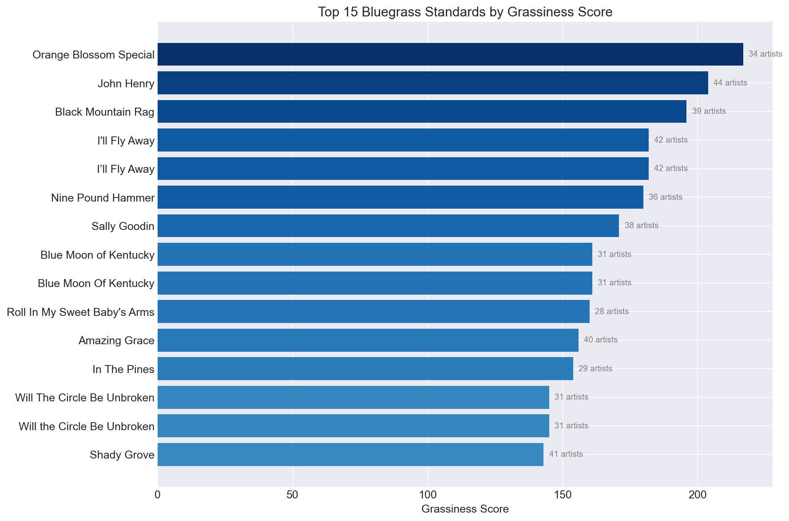
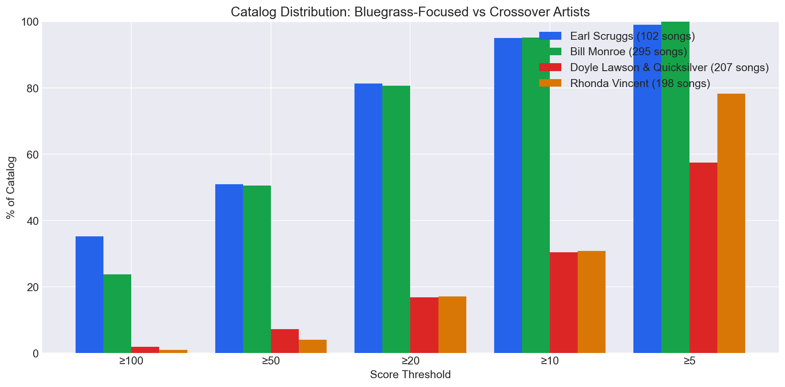

> **Want to explore the data yourself?** Check out the [interactive Jupyter notebook](https://github.com/jollyhrothgar/Bluegrass-Songbook/blob/main/analytics/grassiness_analysis.ipynb) with full visualizations and queries.

One of the first
[criticisms](https://bluegrassbook.com/bluegrass-standards-board.html) I got
when announcing this project on /r/bluegrass was that for a site called
bluegrassbook.com, there's not a lot of bluegrass. There is of course, TONS of
bluegrass here, it's just that bluegrass is a narrow genre - that is also
evolving, and also has traditional roots - plus I want to have jamable bluegrass adjacent music here. Elvis Presley is not bluegrass (but he
does cover [Bill
Monroe](https://www.youtube.com/watch?v=RIyNJHwfmak&list=RDRIyNJHwfmak&start_radio=1)
songs)! 

## The Problem

When I first added genre tags to the songbook, I used artist-level tagging from MusicBrainz. If an artist was tagged "bluegrass," all their songs got the Bluegrass tag. Simple, right?

The problem: Dolly Parton has three bluegrass albums (The Grass Is Blue, Little Sparrow, Halos & Horns), so all 156 of her songs were tagged as "Bluegrass" - including "9 to 5" and "Jolene." This is compounded by the fact that we love Dolly, and people jam her songs in bluegrass settings.

Still, in order to satisfy the masses (and also prepare for massive amounts of more data I want to add), I need a better mechanism for tagging songs as bluegrass to create a better "first visitor" experience to this site.

## The Approach: Grassiness Scoring

As an ML engineer and data scientist, I'd normally get a bunch of labeled data and then drop everything into a model to learn how to "label." Only, in this case, there are no labels - so I had to create a repeatable mechanism to "roughly label" the data into a tight cluster of "bluegrass" so that users can find stuff and then help build a better site by voting on what tags they feel are most appropriate.

### Signal 1: Curated Artist Covers

If Bill Monroe, the Stanley Brothers, or Del McCoury recorded a song, it's probably bluegrass. I built a database of 292 bluegrass artists from Wikipedia and contemporary bluegrass charts, then queried MusicBrainz for every recording by these artists.

Artists are weighted by era:
- **Tier 1 (weight 4x)**: Founding figures - Bill Monroe, Stanley Brothers, Flatt & Scruggs, Jimmy Martin, Mac Wiseman
- **Tier 2 (weight 2x)**: Classic era - Doc Watson, Country Gentlemen, Seldom Scene, Tony Rice, Del McCoury
- **Tier 3 (weight 1x)**: Modern era - Billy Strings, Molly Tuttle, Nickel Creek

The intuition: If Bill Monroe recorded it, that's strong evidence. If only Billy Strings covered it, that's weaker (because modern artists cover lots of non-bluegrass material).

### Signal 2: MusicBrainz Community Tags

To catch songs by artists not in the curated list, I also query recordings and albums tagged "bluegrass", "newgrass", or "old-time" in MusicBrainz. This provides a secondary boost.

### The Combined Score

```
grassiness = artist_score + min(tag_score, 10)
```

The tag score is capped at 10 to prevent it from overwhelming the artist signal. With this, I have a numeric parameter that I can apply to the whole corpus and then sort songs by "grassiness". But then I need to apply a cutoff, somewhere. But where?

## Setting Thresholds: Let the Data Decide

How do you decide what score means "definitely bluegrass"? I let the core artists tell us.

I analyzed the catalog distribution of 15 definitive bluegrass artists (Bill Monroe, Stanley Brothers, Ralph Stanley, Earl Scruggs, Doc Watson, etc.) - about 3,400 songs total.

The question: at each threshold, what percentage of their songs qualify?

Here's how individual artists break down (what % of their songs pass each threshold):


The 71% line at >=20 is the sweet spot - it captures most of what the legends recorded while excluding the bottom-tier crossover material.


This gives us natural cutoffs:
- **50+**: Top third of what legends recorded = "Bluegrass Standard"
- **20+**: Top 71% of what legends recorded = "Bluegrass"
- **<10**: Bottom 11% - crossover territory

## The Score Distribution

Here's what the grassiness scores look like across all 5,876 songs that have any bluegrass signal:


The long tail at the bottom is crossover - songs that bluegrass artists covered but aren't really "bluegrass songs."

## Validation: Does It Work?

Here are some scores:

**Top Bluegrass Standards (by score):**



**Correctly excluded (low scores):**

```
  10 │ Jolene                    │ Borderline - some bluegrass covers exist
  11 │ I Walk The Line           │ Johnny Cash, covered by Marty Stuart
   7 │ Crazy                     │ Patsy Cline - not bluegrass
   1 │ Islands In The Stream     │ Dolly/Kenny Rogers duet
```

**Interesting edge cases:**

```
  22 │ Ring of Fire              │ Earl Scruggs & Mac Wiseman covered it!
  10 │ Wagon Wheel               │ Borderline - it's everywhere now
```

## The Crossover Problem

Here's an interesting finding: **every major bluegrass artist appears in every score bucket.** The Stanley Brothers, Doc Watson, and Mac Wiseman all have songs scoring under 10.

Why? Because legends recorded everything - gospel, folk songs, pop covers. A Stanley Brothers recording of a folk tune isn't necessarily "bluegrass" in the genre sense.

But the *distribution* tells the story:
- Earl Scruggs: 51% of his songs score 50+
- Doyle Lawson: only 7% score 50+ (huge gospel catalog)
- Iron Horse: 16% score 50+ (they do bluegrass covers of rock songs)

The scoring isn't about excluding artists - it's about finding the bluegrass *songs*.

Compare the catalog distributions of different types of artists:



Earl Scruggs played bluegrass. Doyle Lawson & Quicksilver recorded a lot of gospel and country. Both are great artists - but their catalogs tell different stories.

## The Result

I now have:
- **205 Bluegrass Standards** (score >= 50) - the songs every picker should know
- **1,199 Bluegrass songs** (score >= 20) - the full bluegrass collection

Both are available from the homepage. No more Dolly Parton's "9 to 5" in the bluegrass standards.

## What I Learned

1. **Artist-level tagging is too coarse.** You need song-level signals.
2. **Era matters.** Bill Monroe's catalog is 100% bluegrass. Billy Strings covers Grateful Dead songs.
3. **Let the data define thresholds.** Instead of picking arbitrary cutoffs, analyze what the core artists actually recorded.
4. **Crossover is unavoidable.** Some songs live in multiple genres. The scoring handles this gracefully.

The full methodology is documented in the codebase if you want to dig deeper. And if you disagree with any classifications, let me know - the beauty of data-driven approaches is they can be refined over time.

Cheers!
